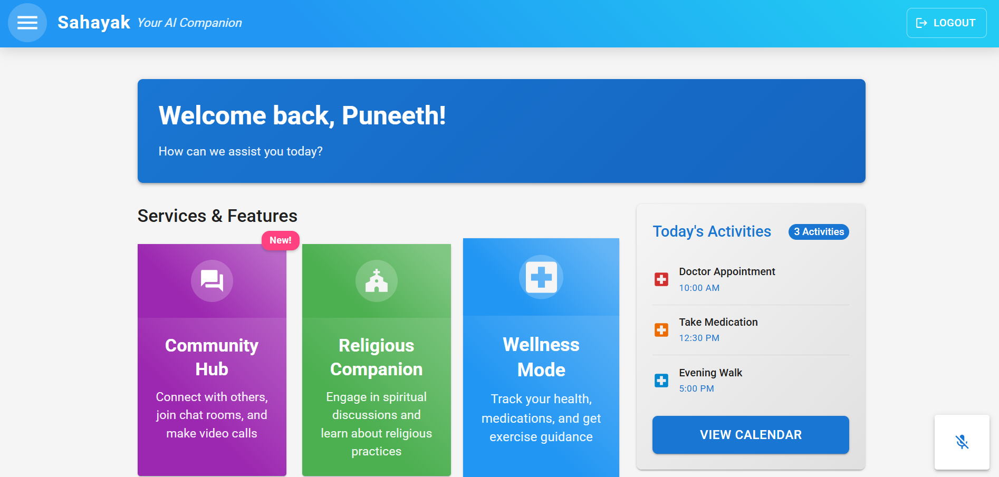

# Sahayak - AI Powered Companion for Senior Citizens

Sahayak is a compassionate AI-powered companion designed specifically for senior citizens, helping them navigate daily life with ease and confidence.

## Features

- **Religious Companion Mode**: Engage in meaningful discussions about religious topics, stories, and teachings
- **Wellness Mode**: Health tracking, medication management, and exercise guidance
- **One-Click Order & Travel**: Simplified ordering and travel booking experience
- **Emergency Support**: Quick access to emergency contacts with location sharing
- **Family Connection**: Secure access for family members to monitor and assist

## Tech Stack

- Frontend: React.js
- Backend: Node.js with Express
- Database: MongoDB
- Authentication: Clerk
- AI Integration: Google Gemini API
- Voice Recognition: Web Speech API

## Getting Started

### Prerequisites

- Node.js (v16 or higher)
- MongoDB
- npm or yarn

### Installation

1. Clone the repository
2. Install backend dependencies:
   ```bash
   cd backend
   npm install
   ```
3. Install frontend dependencies:
   ```bash
   cd frontend
   npm install
   ```
4. Set up environment variables (see .env.example files)
5. Start the development servers:
   ```bash
   # Backend
   cd backend
   npm run dev

   # Frontend
   cd frontend
   npm start
   ```
## live preview
 
 
 
## Security and Privacy

- End-to-end encryption for sensitive data
- Secure authentication via Clerk
- Role-based access control for family members/caretakers
- HIPAA-compliant data storage for health information
